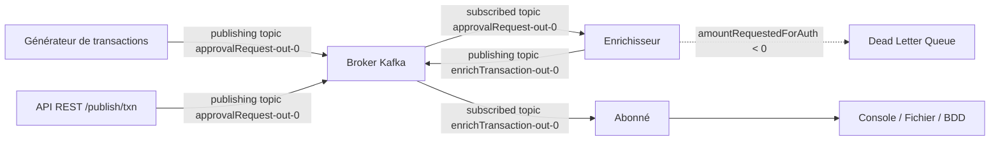

### Le projet "carte prépayée"

Ce projet est un sous-système d'une application de carte prépayée. Il s'agit d'une application event-driven basée sur 
Spring Cloud Stream, qui consomme des transactions depuis un topic Kafka, les enrichit avec des données métier 
(statut d'approbation, informations du porteur de carte), puis les republie sur un nouveau topic pour être consommées 
par les services en aval. Les transactions invalides sont automatiquement routées vers une Dead Letter Queue.



### Build et run

```bash
$ rsync -av --exclude='.git/' --exclude='target/' --delete /mnt/c/Users/sebastien.boulais/projects/event-driven-cashcard-application/ ~/event-driven-cashcard-application
$ mvn clean install (-DskipTests)
$ docker compose up --build --force-recreate
```

### Test KO

Simulation d'une transaction KO, avec un montant négatif, ce qui n'est pas autorisé. La transaction est envoyée à
l'application source via l'API REST, et elle devrait être rejetée et redirigée vers la DLQ (Dead Letter Queue) pour un
traitement ultérieur.

```bash
curl -d '{"id":100,"cashcard":{"id":209,"owner":"Lilou","amountRequestedForAuth":-21.95}}' -H "Content-Type: application/json" -X POST http://localhost:8080/publish/txn
```

### Analyser les topics Kafka

```bash
$ docker exec -it broker /opt/kafka/bin/kafka-console-consumer.sh --bootstrap-server broker:9092 --topic approvalRequest-out-0
$ docker exec -it broker /opt/kafka/bin/kafka-console-consumer.sh --bootstrap-server broker:9092 --topic enrichTransaction-out-0
$ docker exec -it broker /opt/kafka/bin/kafka-console-consumer.sh --bootstrap-server broker:9092 --topic enrichTransaction.DLQ --from-beginning
```